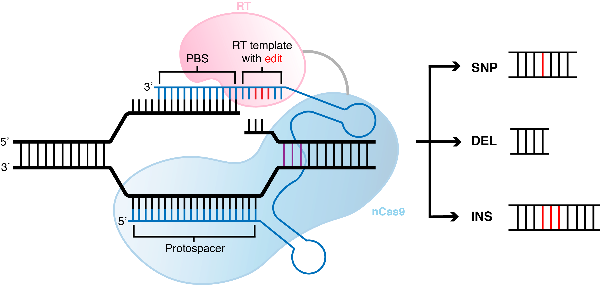
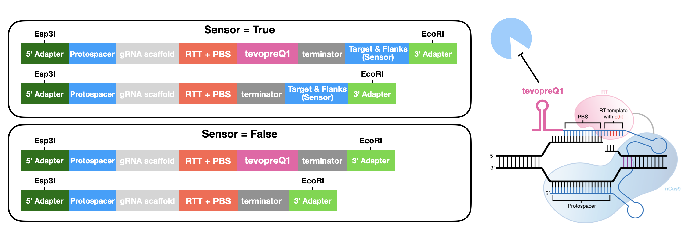

🚀 Quickstart 
==============

Installation
**************
PEGG is available through the python package index. To install, use pip: 

.. code-block:: python

   pip install pegg

To modify and/or download specific python files, download the package from the `Github Repository <https://github.com/samgould2/PEGG2.0>`_ .

Input Formatting
**************************

Prime editing can generate a range of small mutations, including substitutions, insertions, and deletions: 

In order to use PEGG to design pegRNAs, you must provide a set of mutations in a pandas DataFrame for PEGG to use.
There are 3 acceptable input formats that PEGG accepts

(1) WT-ALT Format
~~~~~~~~~~~~~~~~~~~~~~~~~~~~~~
In this format, the user feeds in a set of wildtype sequences, and the corresponding set of desired mutant sequences.
PEGG then uses a built-in aligner to determine the mutation from these sequences, and design pegRNAs for these variants.
Note: Complex INDELs will break this function because they are difficult to align. If you want to design INDELs, use one of the two formats below.

The pandas DataFrame must have at least 2 columns, with the following column names **(1) 'WT'** and **(2) 'ALT'**

(2) PrimeDesign Format
~~~~~~~~~~~~~~~~~~~~~~~~~~~~~~

In this format, users feed in a set of sequences with the desired edit in `PrimeDesign <https://primedesign.pinellolab.partners.org/>`_ format.
For example, an A>G SNP would look like: "AATCG(A/G)GCTAG", a "GTT" insertion would be: "AATCG(/GTT)GCTAG", a "GTT" deletion: "AATCG(GTT/)GCTAG", and a "C>GTT" INDEL: "AATCG(C/GTT)GCTAG".
It is reccomended that you include at least 100 nt of context sequence on either side of the variant.

The pandas DataFrame must have at least 1 column, with the following column name: **(1) 'SEQ'** .
This column contains the PrimeDesign formatted sequences.

(3) cBioPortal Format
~~~~~~~~~~~~~~~~~~~~~~~~~~~~~~

In this format, users simply provide a set of variants with their genome coordinates and reference and alternate alleles, as well as the variant type.
This format is compatible with all of the datasets in the `cBioPortal <http://www.cbioportal.org/datasets>`_ , which contains cancer-associated variant datasets.

If you want to build you own mutation dataset, it must have the following columns, with the associated column header names, in .csv format:

1. Chromosome: which chromosome the mutation falls in. Use integers or 'X' and 'Y'.

2. Start_Position: start position of mutation in the reference genome (mutations should only be reported on the + strand)

3. End_Position: end position of mutation in the reference genome

4. Variant_Type: what type of mutation is it. Options: "SNP", "ONP", "INS", "DEL", "INDEL"

5. Reference_Allele: what is the reference allele. For insertions, this should be set to "-".

6. Tumor_Seq_Allele2: what is the mutant allele (i.e. what is the mutation sequence). For deletions, this should be set to "-".

An example for loading in a dataset is provided here:

.. code-block:: python

   import pandas as pd

   #------(1) loading in input mutatations-------------
   filepath = '.../2020-06-16-MSK-IMPACT_EDITED.txt'
   mutant_input = pd.read_csv(filepath, sep='\t')

.. image:: mutant_input.png

Other columns that you include in the DataFrame (e.g. HGVSp or HGVSc) will be retained by PEGG when it outputs the pegRNAs.

(3b) Reference Genome
~~~~~~~~~~~~~~~~~~~~~~~~~~~~~~

In addition, to use the "cBioPortal" input format, you must provide a genome that PEGG can use to find the associated sequences. 
There is a built in genome loader function that you can use, or you can format the chromosome sequences in a dictionary, with the keys as the chromosome identifiers:

.. code-block:: python

   from pegg.prime import pegg2 

   #filepath to .gz containing reference genome (here = GrCh37)
   filepath = './GCF_000001405.25_GRCh37.p13_genomic.fna.gz'

   chrom_dict, i = pegg2.genome_loader(filepath)

You can access the genome files at this link: `Reference Files Dropbox Link <https://www.dropbox.com/sh/5xsdzyiyrjiu9pf/AADiFFA3BQ3vX7swja-i2NBqa?dl=0>`_

It has been tested on human and mouse genomes.

(4) ClinVar mutations
~~~~~~~~~~~~~~~~~~~~~~~~~~~~~~

PEGG also has a built-in function for translating ClinVar IDs to the "cBioPortal" input format. To do so, download a ClinVar vcf.gz file,
and choose your desired Variation IDs that you wish to model. These vcf.gz files are available in the `Reference Files Dropbox Link <https://www.dropbox.com/sh/5xsdzyiyrjiu9pf/AADiFFA3BQ3vX7swja-i2NBqa?dl=0>`_ (under the clinvar folder)
or the more up to date files can be accessed here: https://ftp.ncbi.nlm.nih.gov/pub/clinvar/

These variation IDs are the identifiers for ClinVar variants:

See the below codeblock for the precise syntax:

.. code-block:: python

   from pegg.prime import pegg2 

   #filepath to the clinvar vcf.gz file
   filepath = '.../GrCh37_clinvar_20230923.vcf.gz'
   variation_ids = [925574, 925434, 926695, 925707, 325626, 1191613, 308061, 361149, 1205375, 208043]
   df = pegg2.clinvar_VCF_translator(filepath, variation_ids)

Generating pegRNAs
********************

To run PEGG to generate pegRNA-sensor pairs with the default parameters, simply execute the following code, 
which shows an example with PrimeDesign format:

.. code-block:: python

   from pegg.prime import pegg2 
   import pandas as pd

   seqs = ['AAAATCGTAGCTAGGCGTAGGGCGCGCGGGCTCGGAGGCGCGATGCGCAT(A/G)TGGATCGGGCTAGGCTAGCGCGGGCTAGCTAGCTTCGAGCCGCTA',
        'AAAATCGTAGCTAGGCGTAGGGCGCGCGGGCTCGGAGGCGCGATGCGCAT(/GTGC)TGGATCGGGCTAGGCTAGCGCGGGCTAGCTAGCTTCGAGCCGCTA',
        'AAAATCGTAGCTAGGCGTAGGGCGCGCGGGCTCGGAGGCGCGATGCGCAT(A/GTGC)TGGATCGGGCTAGGCTAGCGCGGGCTAGCTAGCTTCGAGCCGCTA']

   input = pd.DataFrame(dict(zip(['SEQ'], [seqs])))
   
   #options = 'cBioPortal', 'WT_ALT', 'PrimeDesign'
   input_format = 'PrimeDesign'
   
   pegRNAs = pegg2.run(input, input_format)

This will output a dataframe that contains the pegRNA-sensor designs with default parameters.

Design Options
~~~~~~~~~~~~~~~~~~~~~~~~~~~~~~

There are a whole host of design parameters for the pegRNAs and sensors that can be customized.

**pegRNA parameters:**

- **PAM** = PAM sequence for searching. Default = "NGG". Can include any nucleic acid code (e.g. PAM = "NRCH").

- **rank_by** = What pegRNA parameter to rank pegRNAs by. Options = "PEGG2_Score" (default; weighted linear regression of different pegRNA parameters; r~.4) or "RF_Score" (random forest predictor of pegRNA efficiency; r~.6).

- **pegRNAs_per_mut**: How many pegRNAs to produce per mutation. If you input an integer value *n*, PEGG will automatically select the *n* top ranked pegRNAs for that variant. Default = 'All' (all possible pegRNAs with parameters). Otherwise, choose an integer value (e.g. 5).

- **RTT_lengths**: List containing RTT lengths to design pegRNAs for. Default = [5,10,15,20,25,30]

- **PBS_length**: List containing PBS lengths to desing pegRNAs for. Default = [8,10,13,15]

- **min_RHA_size**: Minimum size of the RHA (Right homology arm). Default = 1. Generally pegRNAs with smaller RHA perform poorly.

- **RE_sites**: A list containing the RE recognition sites to filter (e.g. ['CGTCTC', 'GAATTC'] for Esp3I and EcoRI). Default = None (no filtration).

- **polyT_threshold**: The length of the polyT sequence to classify a pegRNA and/or sensor as containing a terminator. Default = 4.

- **proto_size**: The length of the protospacer (excluding the appended G at the 5' end). Default = 19 (G+19).

- **context_size**: The amount of context/flanking sequence on either side of the mutation to generate. For larger variants, set this larger. Default = 120. e.g. AAA(A/G)AAA = context_size of 3

**sensor parameters** (see section below for more information on sensor)

- **sensor:** True/False whether to include a sensor in the pegRNA design or not. 

- **before_proto_context**: Default = 5. Amount of nucleotide context to put before the protospacer in the sensor

- **sensor_length**: Total length of the sensor in nt. Default = 60. 

- **sensor_orientation**: Orientation of the sensor relative to the protospacer. Options for sensor_orientation = 'reverse-complement' or'forward'. Default = 'reverse-complement' (to minimize recombination).

Base Editing
**************

PEGG also contains a base editing module for designing base editing gRNA-sensor pairs.
The input format is the same as for pegRNA generation ("cBioPortal", "PrimeDesign", or "WT_ALT").
The base editing design function will automatically filter non-SNP variants, and can be set to filter variants amenable to
adenine base editing (ABE: A>G or T>C variants) and cytosine base editing (CBE: C>T or G>A variants):

.. code-block:: python

   from pegg.base import base_editing
   import pandas as pd

   seqs = ['AAAATCGTAGCTAGGCGTAGGGCGCGCGGGCTCGGAGGCGCGATGCGCAT(A/G)TGGATCGGGCTAGGCTCGGAGCGGCGGGCTAGCTAGCTTCGAGCCGCTATCGCCCATCCTGCAC',
         'AAAATCGTAGCTAGGCGTAGGGCGCGCGGGCTCCGGAGGCGCGATGCGCAT(C/T)TGGATCGGGCTAGGCTCGGAGCGGCGGGCTAGCTAGCTTCGAGCCGCTATCGCCCATCCTGCAC',
         'AAAATCGTAGCTAGGCGTAGGGCGCGCGGGCTCCGGAGGCCGCGATGCGCAT(T/C)TGGATCGGGCTAGGCTCGGAGCGGCGGGCTAGCTAGCTTCGAGCCGCTATCGCCCATCCTGCAC']

   input = pd.DataFrame(dict(zip(['SEQ'], [seqs])))
   input_format = 'PrimeDesign'

   gRNAs = base_editing.run_base(input, input_format, chrom_dict=None)

Design Options
~~~~~~~~~~~~~~~~~~~~~~~~~~~~~~
Similar to pegRNA design, there are also multiple options for the base editing gRNA-sensor design function.

- **PAM**: PAM sequence for searching. Default = "NGG". Can include any nucleic acid code (e.g. PAM = "NRCH").

- **filtration**: Filters the mutation input list to only include the desired SNPs. Options = "No filter", "ABE", "CBE", "ABE+CBE", or a list containing the desired SNPs to model (e.g. ['C>A', 'T>C']). Default = "ABE+CBE", filtering for only ABE or CBE amenable SNPs.

- **ideal_edit_window**: Ideal editing window for the editor being used. Default = [4,8]. Labels mutations that fall in this window for future filtration if desired.

- **auto_SNP_filter**: True/False for whether to filter mutant input to exclude mutations that are NOT SNPs (and thus not BE amenable). Highly reccomended to keep this as True.

- **proto_size**: The length of the protospacer (excluding the appended G at the 5' end). Default = 19 (G+19).

- **other parmeters are same as for pegg2.run()**: context_size, RE_sites, polyT_threshold, before_proto_context, sensor_length, sensor_orientation, sensor.

Sensor Design
***************

The sensor is an artificial copy of the endogenous target that links each `pegRNA <https://www.biorxiv.org/content/10.1101/2022.10.26.513842v4>`_  or `base editing gRNA <https://www.nature.com/articles/s41587-021-01172-3>`_ to its editing outcome at the endogenous locus.
This allows for the systematic identification of high efficiency pegRNAs while controlling for the confounding effects of variable editing efficiency in a screening context.

As discussed above, the parameters for sensor design are:

- **sensor:** True/False whether to include a sensor in the pegRNA design or not. 

- **before_proto_context**: Default = 5. Amount of nucleotide context to put before the protospacer in the sensor

- **sensor_length**: Total length of the sensor in nt. Default = 60. 

- **sensor_orientation**: Orientation of the sensor relative to the protospacer. Options for sensor_orientation = 'reverse-complement' or'forward'. Default = 'reverse-complement' (to minimize recombination).

Here's an example of a "forward" oriented sensor:

And a "reverse-complement" oriented sensor:

.. image:: sensor_rc.png

There are cases where it is not possible to produce a sensor for a given pegRNA or gRNA. 
For example, if a deletion is too large such that it goes beyond the sequence contained in a sensor, PEGG will not produce a sensor sequence for that pegRNA.
This information is contained in the "sensor_error" column of the output of pegg2.run() or base_editing.run_base().

Oligo Generation
******************

To automatically generate oligonucleotides that contain the pegRNAs or designed using PEGG, the **pegg2.prime_oligo_generator()**
function provides multiple options, and produces a **pegRNA oligo** or **epegRNA oligo** (with a 3' structural motif, `tevopreQ1 or mpknot <https://www.nature.com/articles/s41587-021-01039-7>`_).
These oligos are designed with premade adapters for restriction cloning. These adapters, as well as the scaffold sequence, and epegRNA motif, can be customized:

Future versions of PEGG will include the ability to automatically generate oligos for Golden Gate pegRNA cloning.

There is also a similar function for generating base editing gRNA oligos, the **base_editing.base_oligo_generator()** function. 
Again, the adapters are customizable, as is the gRNA scaffold sequence.

For full documentation, see the **complete function documentation** page.

Future versions of PEGG will include the option to automatically generate barcodes for these oligos.

Library Design
*****************

PEGG also contains a library design module. This module can produce non-targeting, safe-targeting, and silent control guides
to act as controls in pooled screening. Non-targeting guides target no location in the genome (taken from `Meier et al., 2017 <https://www.nature.com/articles/nmeth.4423>`_), 
while safe-targeting guides target "safe regions" with no annotated function, as defined by `Morgens et al., 2017 <https://www.nature.com/articles/ncomms15178>`_ .

Note: safe-targeting guides require human genome **GRCh37** or mouse genome **GRCm38**

.. code-block:: python

   from pegg.prime import pegg2 
   from pegg.library_design import library

   #filepath to .gz containing reference genome (here = GrCh37)
   filepath = './GCF_000001405.25_GRCh37.p13_genomic.fna.gz'
   chrom_dict, i = pegg2.genome_loader(filepath)

   #generate 100 safe-targeting loci that can be fed into PEGG
   num_muts = 100
   safe = library.safe_muts(num_muts, chrom_dict, organism='human')

   #and also generate 100 non-targeting guides for prime editing
   num_guides = 100
   nontarget = library.nontargeting_guides(num_guides, edit_type='prime')

There's also a function for generating neutral/silent substitutions for a particular transcript:

.. code-block:: python

   from pegg.library_design import library

   gene_name='TP53'
   strand = '-' #strand of the transcript
   chrom=17
   #listing CDS of transcript ordered by +end
   start_end_cds = [[7572930, 7573008],
   [7573927, 7574033],
   [7576853, 7576926],
   [7577019, 7577155],
   [7577499, 7577608],
   [7578177, 7578289],
   [7578371, 7578554],
   [7579312, 7579590],
   [7579700, 7579721],
   [7579839, 7579912]]

   neutral_p53 = library.neutral_substitutions(gene_name, chrom, strand, start_end_cds, chrom_dict)

PEGG contains additional functions for aggregating mutations for a particular gene.
There's also a **library_maker()** function that combines all of the above functions to generate libraries in one shot.
**For a full example that highlights all of the library_design functionality, see the Jupyter notebook tutorial.**

Visualizations
******************
PEGG contains built-in functions for pegRNA-sensor and gRNA-sensor pairs:

.. code-block:: python

   from pegg.prime import pegg2

   #visualizing pegRNA-sensor in row #4 from the 
   #gRNAs DataFrame which contains the pegRNAs produced by pegg2.run()
   base_editing.sensor_viz(pegRNAs, 4)

.. code-block:: python

   from pegg.base import base_editing

   #visualizing gRNA-sensor in row #4 from the 
   #gRNAs DataFrame which contains the base editing gRNAs produced by base_editing.run_base()
   base_editing.sensor_viz_base(gRNAs, 4)

.. image:: sensor_base_forward.png

